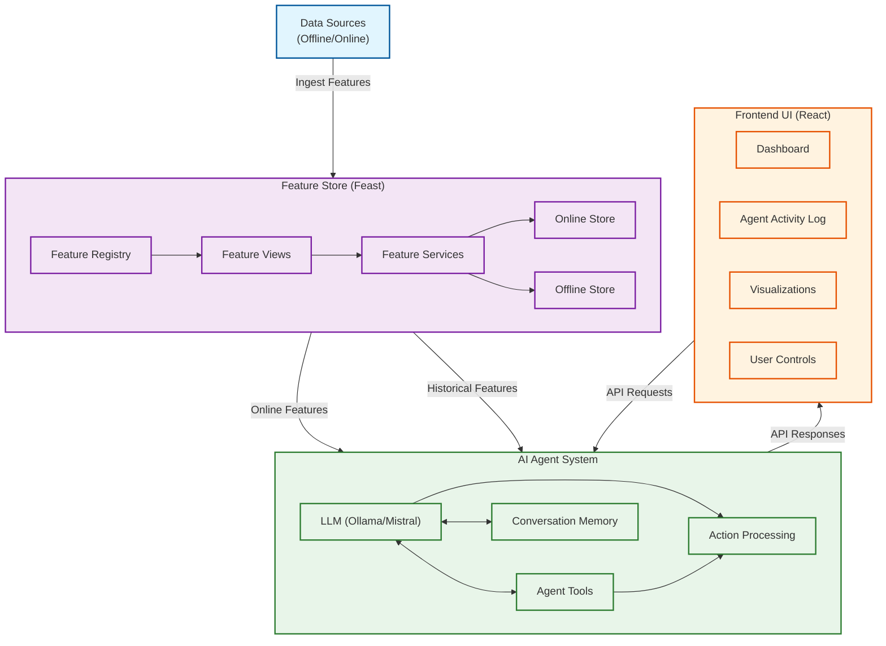

# Agentic AI with Feast Feature Store - Architecture

## Architecture Components

### 1. Data Sources
- Batch data from data warehouse
- Streaming data for real-time features
- Transactional systems and databases

### 2. Feature Store (Feast)
- **Feature Registry**: Centralized repository of feature definitions
- **Feature Views**: Logical groupings of related features
- **Feature Services**: Feature collections for specific ML use cases
- **Online Store**: Low-latency feature serving for real-time inference
- **Offline Store**: Historical feature storage for training and analysis

### 3. AI Agent System
- **LLM (Ollama/Mistral)**: Reasoning engine for the agent
- **Agent Tools**: Specialized functions for different tasks
- **Memory**: Conversation buffer for context retention
- **Action Processing**: Request handling and response generation

### 4. Frontend UI
- **Dashboard**: Main interface for interacting with the agent
- **Agent Activity Log**: History of agent actions and responses
- **Visualizations**: Charts and graphs for feature data and results
- **User Controls**: Inputs for triggering agent actions