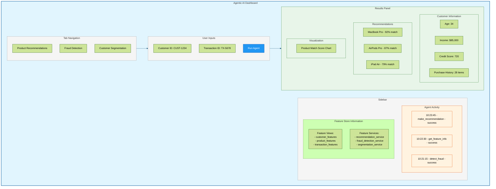

# Agentic AI with Feast Feature Store - Demo Interface

## Dashboard Components

### 1. Tab Navigation
Users can select different AI agent capabilities:
- Product Recommendations
- Fraud Detection
- Customer Segmentation

### 2. User Inputs
- Customer ID input for recommendations and segmentation
- Transaction ID input for fraud detection
- Run Agent button to execute the selected agent action

### 3. Results Panel
Dynamic content based on the selected tab:

**For Recommendations:**
- Customer information (age, income, purchase history)
- Product recommendations sorted by match score
- Visualization of match scores

**For Fraud Detection:**
- Transaction details
- Fraud risk assessment with score
- Risk factors identified

**For Customer Segmentation:**
- Comprehensive customer profile
- Segment assignment with explanation
- Recommended strategies for the segment

### 4. Sidebar
- **Agent Activity Log**: Chronological history of agent actions
- **Feature Store Information**: Available feature views and services